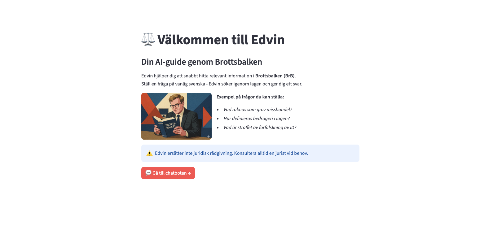
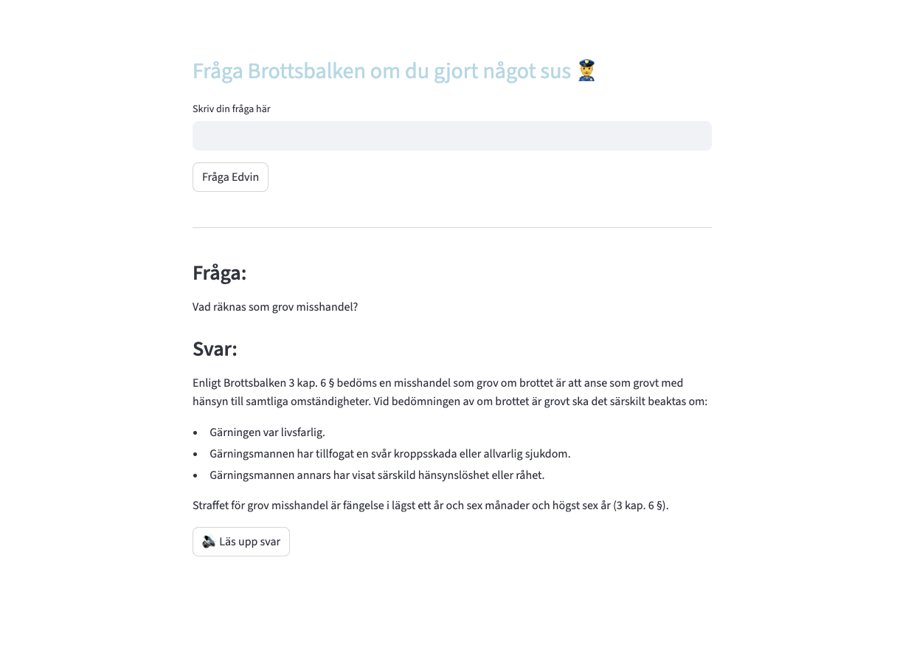
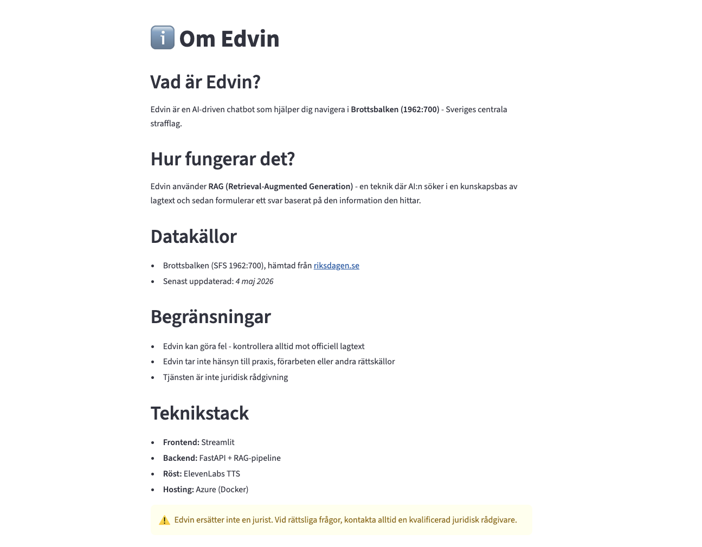
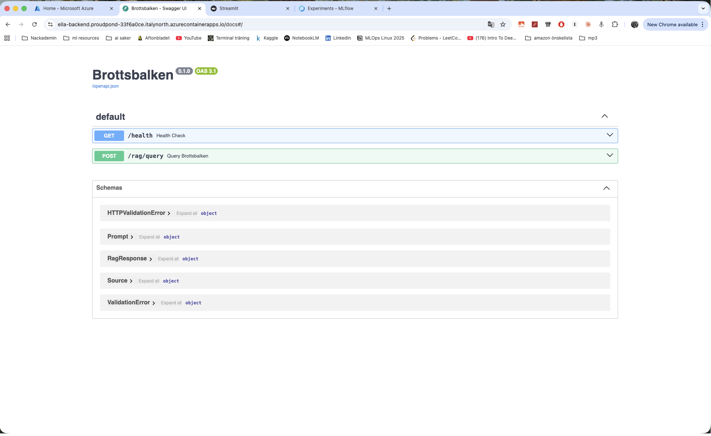
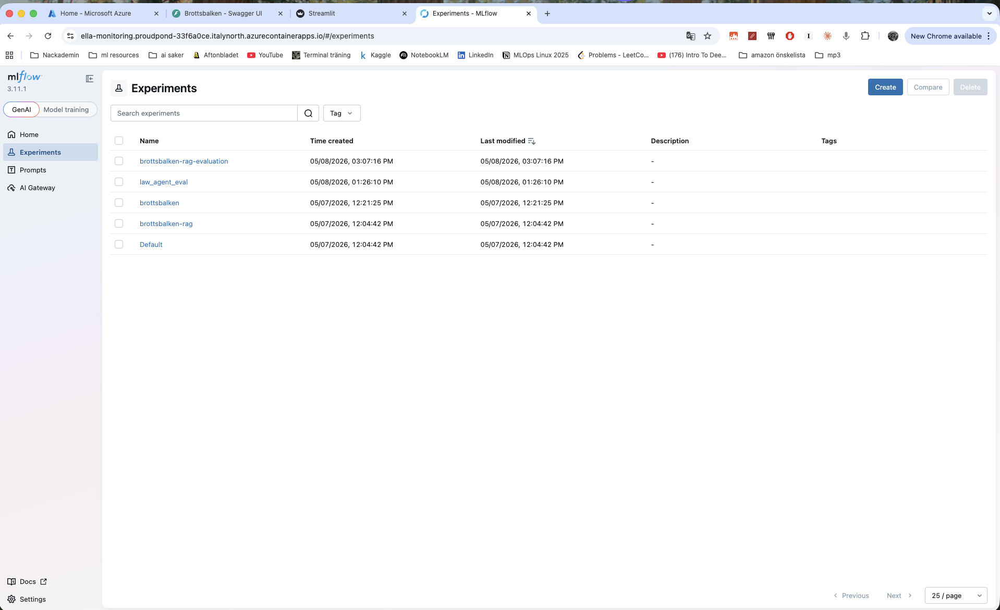

# ELLA_fab4
LLMops school project

# ELLA_fab4 - Brottsbalken Chatbot
Detta är ett AI Engineering / LLMOps-projekt där vi bygger en chatbot för **Brottsbalken (1962:700)**.
Målet är att göra juridisk information mer tillgänglig genom en RAG-baserad lösning med källnära svar.

## Projektidé
Vi bygger en chatbot där användaren kan ställa frågor om Brottsbalken och få:
- ett begripligt svar
- hänvisning till relevanta kapitel/paragrafer
Projektet är en del av kursen i AI Engineering och LLMOps och utvecklas med agilt arbetssätt i grupp.

## Arkitektur 
1. **Rådata**: Brottsbalken i markdown/json
2. **Parsing**: extraherar metadata, kapitel, paragrafer
3. **Datastädning**: normaliserad paragrafdata
4. **Embedding**: vektorrepresentation av text
5. **Vector DB**: lagring och semantisk sökning i LanceDB
6. **API + LLM**: FastAPI endpoint för chatbot-svar
7. **Frontend**: användargränssnitt för chat

Dataöversikt
Nuvarande dataset innehåller:

38 kapitel
556 paragrafer
Tech stack
Python 3.12+
FastAPI (backend, planerad integration)
LanceDB
Pandas
Pydantic / Pydantic-AI
Streamlit (möjlig frontend/prototyp)
MLflow (bonusspår)
Kom igång lokalt (work in progress)
uv sync
python src/brottsbalken/scripts/parse.py
python src/brottsbalken/scripts/vectorize.py
Körinstruktioner uppdateras när backend/frontend är integrerade.

Arbetssätt (kurskrav)
Vi följer kursens gemensamma krav:

branches + pull requests
kanban + issues
gemensamt repo per grupp
way of working-dokument
presentation med demo
Se way_of_working.md för detaljer.

## Screenshots

### Startsida

### Chatbot

### Info-sida

### Backend

### MLflow experiments

Begränsningar / disclaimer
Denna chatbot är ett utbildningsprojekt och ersätter inte juridisk rådgivning. Modellen kan göra fel; svar bör verifieras mot original lagtext.

Team
Edvin Glawing, Linus Larsson, Lucas Lindh, Andreas Eriksson

## Repo Structure

.
├── Dockerfile
├── HOW_TO_RUN.md
├── README.md
├── docker-compose.yaml
├── explorations
│   ├── exploration.ipynb
│   └── vectorize.ipynb
├── pyproject.toml
├── src
│   └── brottsbalken
│       ├── __init__.py
│       ├── __pycache__
│       │   └── __init__.cpython-312.pyc
│       ├── backend
│       │   ├── Dockerfile
│       │   ├── __init__.py
│       │   ├── __pycache__
│       │   ├── agents.py
│       │   ├── api.py
│       │   ├── constants.py
│       │   ├── data_models.py
│       │   ├── middleware.py
│       │   ├── pyproject.toml
│       │   └── retriever.py
│       ├── data
│       │   ├── clean_data
│       │   └── raw_data
│       ├── frontend
│       │   ├── Dockerfile
│       │   ├── Edvin.png
│       │   ├── __pycache__
│       │   ├── app.py
│       │   ├── edvin_lagbok.png
│       │   ├── pages
│       │   ├── pyproject.toml
│       │   └── utils.py
│       ├── knowledge_base
│       │   └── lancedb
│       ├── monitoring
│       │   ├── Dockerfile
│       │   ├── __init__.py
│       │   ├── evaluation_data_short.json
│       │   ├── mlflow.db
│       │   ├── monitoring.ipynb
│       │   ├── prompt_engineering.ipynb
│       │   └── pyproject.toml
│       └── scripts
│           ├── __init__.py
│           ├── __pycache__
│           ├── parse.py
│           └── vectorize.py
├── uv.lock
└── way_of_working.md